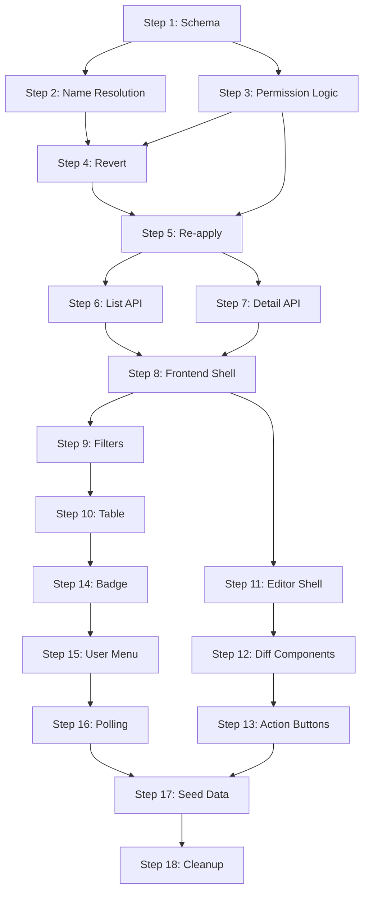

# Project Implementation Plan: Audit Log & Moderation

## Reference: Project Vision (from HLD)
* **Product**: Open-source wiki visualizing cycling team history (Jersey Slices, Diagram).
* **Core Concept**: "Managerial Node" tracks legal entity. "Team Era" tracks yearly snapshot.
* **Visual Signature**: "River" diagram with "Jersey Slices" (sponsor mix).
* **Data Strategy**: "Gentle Scraper" seeds data; User edits lock data.

## Key Definitions
* **Managerial Node**: Persistent entity (e.g. Quick-Step management).
* **Team Era**: Yearly snapshot (e.g. 2012 Team Sky).
* **Lineage Event**: Merge, Split, Rebrand.
* **Jersey Slice**: Vertical bar representing sponsor prominence.

---

## Context & Goals
**Objective**: Build a comprehensive Audit Log system to track, review, and manage changes to cycling team lineage data (Teams, Eras, Sponsors, Brands, Links, Lineage Events).

**Architecture**:
*   **Backend**: `EditHistory` model tracks all changes (`snapshot_before` vs `snapshot_after`). `audit_log.py` router replaces legacy moderation.
*   **Frontend**: `AuditLogPage` (list) and `AuditLogEditor` (detail).
*   **Moderation Workflow**:
    1.  User submits edit → Status `PENDING`.
    2.  Moderator reviews in `AuditLogEditor`.
    3.  Moderator Actions:
        *   **Approve**: Applies changes to live data. Status → `APPROVED`.
        *   **Reject**: Discards changes (requires notes). Status → `REJECTED`.
    4.  Post-Review Actions:
        *   **Revert**: Reverses an approved edit (creating a new `REVERTED` entry).
        *   **Re-apply**: Re-submits a rejected/reverted edit.

**Current State**:
*   Moderation Queue has been decommissioned and replaced by the Audit Log.
*   Basic `DiffTable` visualizes JSON changes.
*   Next focus: improving the "Changes" view with entity-aware components (Step 12).

---

## Technical TDD Steps

> **TDD Cycle**: For each step: Write failing test → Implement minimum code → Verify green → Refactor

---

## Phase 1: Backend Schema & Models
- [x] **Step 1**: Schema foundation
  - Add `REVERTED` to `EditStatus` enum
  - Add `reverted_at`, `reverted_by` columns to `EditHistory` model
  - Create Alembic migration
  - Create `audit_log.py` schemas (copy from moderation.py, extend)
  - **Tests**: Enum serialization, model instantiation, Pydantic validation

## Phase 2: Backend Service - Core Logic
- [x] **Step 2**: Entity name resolution
  - Add `AuditLogService.resolve_entity_name()` for all 6 entity types
  - Update `format_edit_for_review()` to include resolved names in response
  - **Tests**: Resolve team, era, sponsor, brand, link, lineage → human-readable names

- [x] **Step 3**: Permission & chronology logic
  - Add `can_moderate_edit(current_user, edit_submitter)` 
  - Add `is_most_recent_approved(session, edit)` checker
  - **Tests**: Admin moderates all; Mod blocked from admin edits; Most recent detection

- [x] **Step 4**: Revert logic
  - Implement `revert_edit()` - restore snapshot_before, set REVERTED status
  - **Tests**: Reverts correctly; Fails if not most recent; Mod can't revert admin edit

- [x] **Step 5**: Re-apply logic
  - Implement `reapply_edit()` - apply snapshot_after, set APPROVED status  
  - **Tests**: Re-applies correctly; Fails if newer approved exists; Mod can't reapply admin edit

## Phase 3: Backend API Endpoints
- [x] **Step 6**: Rename routes & list endpoint
  - Rename `/moderation` → `/audit-log`
  - Update list endpoint with filters: status[], entity_type, user_id, date_from/to, entity_search
  - Default sort: newest first
  - **Tests**: All filters work; Old route 404s; Pagination works

- [x] **Step 7**: Detail & action endpoints
  - `GET /audit-log/{edit_id}` - full detail with resolved names + action permissions
  - `POST /audit-log/{edit_id}/revert` with permission check
  - `POST /audit-log/{edit_id}/reapply` with permission check  
  - `GET /audit-log/pending-count` for badge
  - **Tests**: Detail returns resolved names; 403 for insufficient perms; Count accurate

## Phase 4: Frontend API & Page Shell
- [x] **Step 8**: API client + routing
  - Created `auditLog.js` with methods: `getList`, `getDetail`, `revert`, `reapply`, `getPendingCount`
  - Added route `/audit-log` → `AuditLogPage`
  - Created `AuditLogPage.jsx` with maintenance layout, status filters, sortable table
  - Created `AuditLogPage.css` with status badges and responsive styles
  - **Tests**: Frontend tests pass (98 tests)

## Phase 5: Frontend List View
- [x] **Step 9**: Filter controls
  - Status multi-select (Pending default checked)
  - Entity type dropdown
  - Date range pickers (Start/End)
  - **Tests**: Controls render; State updates on change; Backend filters work

- [x] **Step 10**: Data table
  - Sortable columns: Status, Entity Type, Action, Date (Server-side)
  - Columns added: Reviewed By, Submitted By, Summary
  - Note: Sorting by Entity Name/Submitter not supported server-side yet due to data model complexity.
  - Row click → navigate to detail
  - Loading/error states
  - **Pagination**: Added Total count, Page size selector (25, 50, 100), Prev/Next buttons.
  - **Tests**: Table renders; Sorting works; Navigation on click; Pagination works

## Phase 6: Frontend Detail View
- [x] **Step 11**: Editor shell + diff table
  - Create `AuditLogEditor.jsx` with header, back button, metadata section
  - Add route `/audit-log/:editId`
  - Create `DiffTable.jsx` component (Before | After columns, highlight changes)
  - **Tests**: Editor renders; DiffTable highlights differences

- [x] **Step 12**: Entity diff components
  - Create 6 components: `TeamDiff`, `EraDiff`, `SponsorDiff`, `BrandDiff`, `SponsorLinkDiff`, `LineageDiff`
  - Each renders entity-specific fields using `DiffTable`
  - Route to correct component based on entity_type
  - **Tests**: Each diff component renders correct fields

- [x] **Step 13**: Action buttons
  - Approve/Reject buttons (pending status)
  - Revert button (approved status, if most recent)
  - Re-apply button (rejected/reverted status, if chronologically valid)
  - Reject requires notes modal
  - **Tests**: Buttons appear/hide based on status; API called on click

## Phase 7: Navigation & Test Data
- [ ] **Step 14**: Notification badge
  - Create `NotificationBadge.jsx` - yellow circle with count
  - Add to user avatar (bottom-right position)
  - **Tests**: Shows when count > 0; Hidden when 0

- [/] **Step 15**: User menu updates
  - [x] Change "Moderation Queue" → "Audit Log"
  - [x] Show for Moderators AND Admins (not just Admin)
  - [ ] Add `NotificationBadge` next to menu item
  - **Tests**: Menu item visible for mod/admin; Badge shows count
  
- [ ] **Step 16**: Pending count polling
  - Fetch pending count on mount (for mods/admins)
  - Poll every 60 seconds
  - Update badge on change
  - **Tests**: Initial fetch; Updates after interval

- [ ] **Step 17**: Seed test data
  - Create `seed_audit_log_test_data.py` script
  - Generate across all 6 entity types:
    - 5 PENDING edits (2 by Editor, 2 by Mod, 1 by Admin)
    - 3 APPROVED edits
    - 2 REJECTED edits  
    - 1 REVERTED edit
  - **Columns populated**: All fields including source_notes, review_notes

- [x] **Step 18**: Cleanup & integration test
  - Delete `ModerationQueuePage.jsx`, `ModerationQueuePage.css`
  - Run full backend test suite
  - Run full frontend test suite
  - Manual smoke test checklist

---

## Step Dependencies

---

## Estimated Time per Step

| Step | Estimate | Complexity |
|------|----------|------------|
| 1 | 1 hour | Low |
| 2-3 | 2 hours | Medium |
| 4-5 | 2 hours | Medium |
| 6-7 | 2 hours | Medium |
| 8 | 1 hour | Low |
| 9-10 | 2 hours | Medium |
| 11-13 | 3 hours | High |
| 14-16 | 2 hours | Low |
| 17-18 | 1 hour | Low |

**Total: ~16 hours of focused work**
