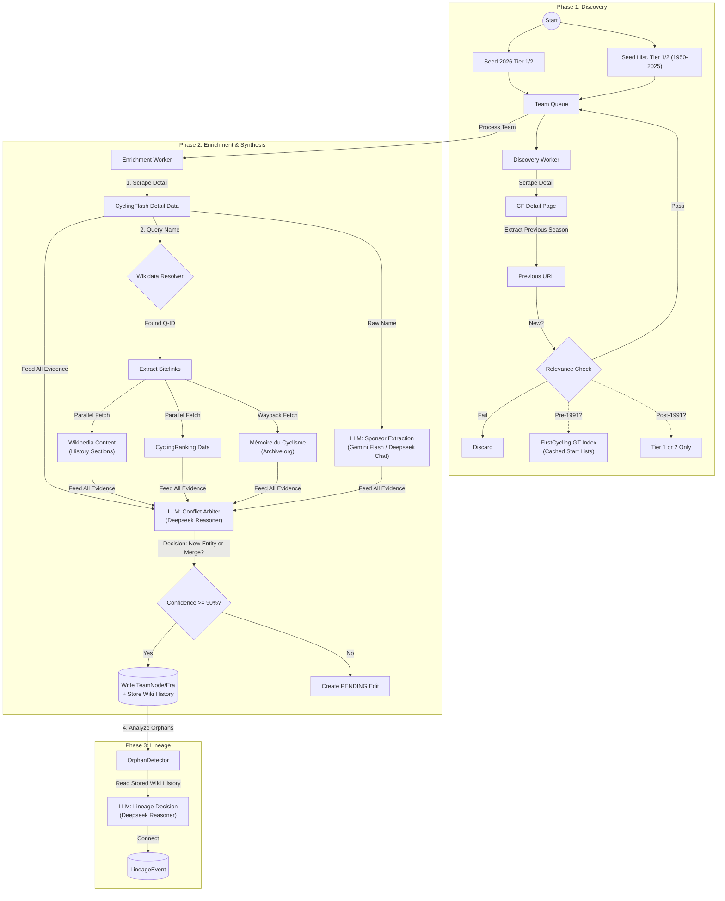

# Smart Scraper: Multi-Source Integration Specification

**Version**: 2.0 (Final Draft)
**Date**: 2026-01-06
**Status**: Ready for Implementation

## 1. Executive Summary

This specification outlines the architecture for transforming the Smart Scraper from a single-source (CyclingFlash) pipeline into a **Multi-Source Logic Engine**. The goal is to resolve complex team lineages (e.g., "Peugeot" vs "Z-Peugeot") by synthesizing data from **CyclingFlash, CyclingRanking, Wikipedia, FirstCycling, and Mémoire du Cyclisme**, using **Wikidata** as the central resolver and **Deepseek Reasoner** as the conflict arbiter.

## 2. Architecture & Workflow

### 2.1 The "Rosetta Stone" Pattern
We do not scrape site-by-site in isolation. We use **Wikidata** to map a team name (from CyclingFlash) to a set of authoritative external URLs.

### 2.2 Workflow Diagram

## 3. Detailed Components

### 3.1 Phase 1: Discovery & Filtering
**Goal**: Build a queue of *relevant* teams only, avoiding Tier 3 clutter.

*   **Seeding Strategy**:
    *   **Modern**: Seed all Tier 1 & Tier 2 teams from Year 2026.
    *   **Historical**: Iterate Years 1950-2025. Seed only teams clearly marked as the highest category (e.g., `Trade Team I`, `Groupe Sportif I`).
*   **Graph Traversal**: Follow `previous_season_url` recursively.
*   **The "Bouncer" (Relevance Validator)**:
    *   **Post-1991 Rule**: Keep if **Tier 1 (WT)** or **Tier 2 (ProTeam)**. Discard Tier 3.
    *   **Pre-1991 Rule**: Keep **ONLY if** the team appears in a **FirstCycling Grand Tour Start List** (Giro, Tour, Vuelta) for that year.
    *   **1991-1998 Exception**: Tier 2 teams must *also* pass the FirstCycling GT check to be kept (filtering weak Tier 2s).

### 3.2 Phase 2: The Rosetta Stone (Entity Resolution)
**Goal**: Link the CyclingFlash team to the rest of the web.

*   **Service**: `WikidataResolver`
*   **Logic**:
    1.  Query Wikidata SPARQL for `item label` matching `{team_name}` AND instance of `cycling team`.
    2.  If match found (e.g., `Q12345`):
        *   Extract **Wikipedia URLs** (sitelinks for EN, FR, NL, IT, ES, DE).
        *   Extract **CyclingRanking ID** (Property PXXXX, or infer from label).
        *   Extract **Official Name** aliases.
    3.  **Fallback**: If Wikidata fails, use direct search or rely solely on CyclingFlash.
    4.  **Safety Net**: If **NO** external match is found, the team is **NOT** discarded.
        *   It is processed as a "CyclingFlash-Only" entity.
        *   **Impact**: We lack the "History" text for Phase 3 arbitration.
        *   **Mitigation**: Phase 3 falls back to `OrphanDetector` heuristics (Year Gap + Fuzzy Name Match) to propose lineage connections.

### 3.3 Phase 2: Conflict Arbitration
**Goal**: Decide if "Team A" and "Team B" are the same Entity or a Split.

*   **Inputs**:
    *   CyclingFlash Dates (e.g., 1912-2008).
    *   CyclingRanking Dates (e.g., 1912-1986).
    *   Wikipedia "History" Text.
*   **LLM Model**: `deepseek-reasoner` (High Intelligence).
*   **Principles**:
    *   **Legal Supremacy**: If the license holder/paying agent changed, it is a **SPLIT**.
    *   **Continuity**: If the "Soul" (Riders/Staff) transferred, treat it as **SPIRITUAL_SUCCESSION**.
*   **Output**: A structured `ArbitrationResult` (Merge, Split, or New Entity).

### 3.4 Data Model Updates
*   **`TeamNode`**: Add `external_ids` (JSONB): `{ "wikidata": "Q..", "cr": "...", "memoire": "..." }`.
*   **`TeamEra`**: Add `source_compatibility` (JSONB) to track conflict status.
*   **`TeamEra`**: Add `wikipedia_history_content` (Text) for Phase 3 usage.

### 3.5 UI & Monitoring (SSE)
*   **Protocol**: Server-Sent Events (SSE).
*   **Endpoint**: `GET /api/admin/scraper/runs/{run_id}/stream`.
*   **Events**:
    *   `decision`: Emitted when LLM arbitrates a conflict. Payload includes confidence, reasoning, and sources.
    *   `progress`: Emitted on item completion.
    *   `log`: Standard logs.

## 4. Error Handling Strategy

| System | Risk | Mitigation |
|--------|------|------------|
| **FirstCycling** | Strict Rate Limiting (10s/req) | **Pre-Scrape Cache**: Fetch all GT start lists (1950-2000 ~150 pages) *once* into a JSON file. Do not hit live site during scrape. |
| **Wikidata** | 429 Too Many Requests | **Exponential Backoff**: Retry 3 times with 2s, 4s, 8s delay. |
| **Wayback Machine** | Slow / Downtime | **Fail-Soft**: If Memoire fetch fails, log warning but proceed with other sources. |
| **LLM** | Hallucination / Timeout | **Confidence Threshold**: Reject if < 90%. Fallback to CyclingFlash-only if API down. |

## 5. Testing Plan

### 5.1 Automated Tests
*   **`test_firstcycling_validator.py`**: Mock the JSON cache. Verify "Peugeot 1980" passes and "Velo Club de Paris" fails.
*   **`test_wikidata_resolver.py`**: Mock SPARQL response. Verify `Peugeot -> Q12345` extraction.
*   **`test_conflict_arbiter.py`**: Feed conflicting dates to the LLM Prompt. Verify it correctly outputs `SPLIT` or `MERGE` according to Legal Supremacy rules.

### 5.2 Integration Tests
*   **`test_phase2_wiring.py`**: Verify `AssemblyOrchestrator` correctly instantiates workers and passes data to the Arbiter.

## 6. Implementation Roadmap
1.  **Slice 1**: Phase 1 Validator (FirstCycling Cache).
2.  **Slice 2**: Wikidata Resolver & Data Model.
3.  **Slice 3**: Parallel Workers & Deepseek Arbiter.
4.  **Slice 4**: Lineage Context (Phase 3).
5.  **Slice 5**: SSE Monitoring UI.
