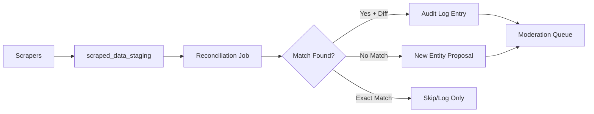
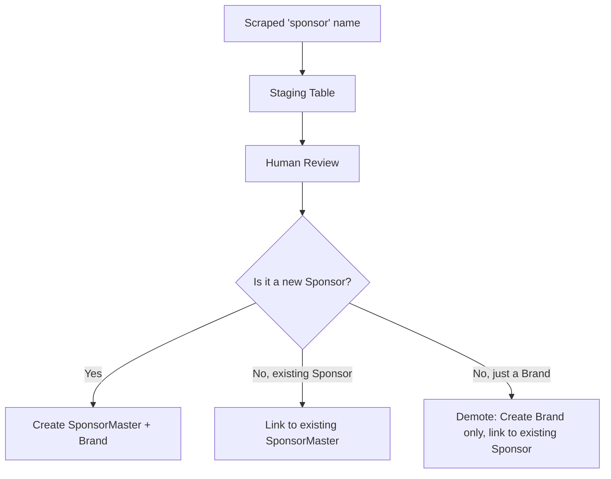
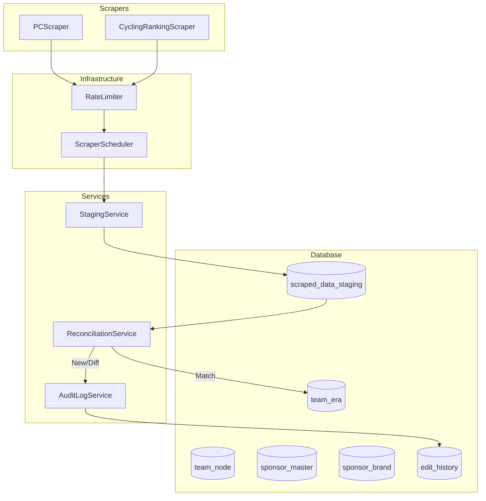
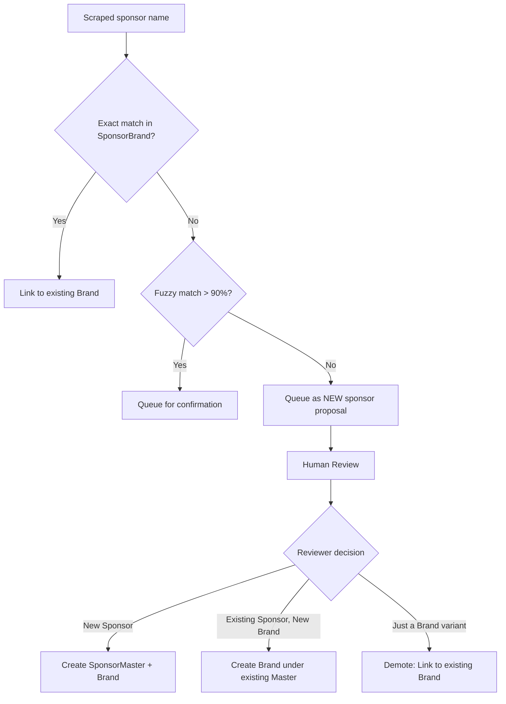
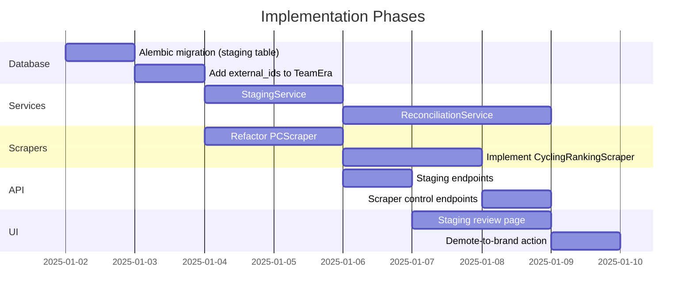

# Chat Conversation

Note: _This is purely the output of the chat conversation and does not contain any raw data, codebase snippets, etc. used to generate the output._

### User Input

Let's create a new branch, we need to work on the scraper now.

*User accepted the command `git status`*

*User accepted the command `git branch`*

*Listed directory [chainlines](file:///c:/Users/fjung/Documents/DEV/chainlines) *

*Listed directory [backend](file:///c:/Users/fjung/Documents/DEV/chainlines/backend) *

*User accepted the command `git checkout -b feature/scraper-groundwork`*

*Edited relevant file*

*Listed directory [app](file:///c:/Users/fjung/Documents/DEV/chainlines/backend/app) *

*Viewed [requirements.txt](file:///c:/Users/fjung/Documents/DEV/chainlines/backend/requirements.txt) *

*Listed directory [docs](file:///c:/Users/fjung/Documents/DEV/chainlines/docs) *

*Listed directory [scraper](file:///c:/Users/fjung/Documents/DEV/chainlines/backend/app/scraper) *

*Viewed [base.py](file:///c:/Users/fjung/Documents/DEV/chainlines/backend/app/scraper/base.py) *

*Viewed [models.py](file:///c:/Users/fjung/Documents/DEV/chainlines/backend/app/scraper/models.py) *

*Listed directory [parsers](file:///c:/Users/fjung/Documents/DEV/chainlines/backend/app/scraper/parsers) *

### User Input

Let's please analyze what's already built, set up, and implemented regarding scraper functionality, and then let's take it from there to flesh out a full concept on how to improve on it. Please ask me one question at a time, building upon my answers to create a detailed concept.

*Viewed [pcs_scraper.py](file:///c:/Users/fjung/Documents/DEV/chainlines/backend/app/scraper/parsers/pcs_scraper.py) *

*Viewed [__init__.py](file:///c:/Users/fjung/Documents/DEV/chainlines/backend/app/scraper/__init__.py) *

*Viewed [rate_limiter.py](file:///c:/Users/fjung/Documents/DEV/chainlines/backend/app/scraper/rate_limiter.py) *

*Viewed [scheduler.py](file:///c:/Users/fjung/Documents/DEV/chainlines/backend/app/scraper/scheduler.py) *

*Viewed [__init__.py](file:///c:/Users/fjung/Documents/DEV/chainlines/backend/app/scraper/parsers/__init__.py) *

### Planner Response

I've now analyzed the existing scraper implementation. Here's a summary of what's already in place:

---

## Existing Scraper Infrastructure

| Component | File | Status |
|-----------|------|--------|
| **Base Scraper** | [base.py](cci:7://file:///c:/Users/fjung/Documents/DEV/chainlines/backend/app/scraper/base.py:0:0-0:0) | ✅ Abstract class with `httpx` async client, rate-limited fetching |
| **Rate Limiter** | [rate_limiter.py](cci:7://file:///c:/Users/fjung/Documents/DEV/chainlines/backend/app/scraper/rate_limiter.py:0:0-0:0) | ✅ Per-domain limiting (default 15s delay) |
| **Scheduler** | [scheduler.py](cci:7://file:///c:/Users/fjung/Documents/DEV/chainlines/backend/app/scraper/scheduler.py:0:0-0:0) | ✅ Round-robin execution, continuous mode support |
| **PCS Parser** | [parsers/pcs_scraper.py](cci:7://file:///c:/Users/fjung/Documents/DEV/chainlines/backend/app/scraper/parsers/pcs_scraper.py:0:0-0:0) | ✅ ProCyclingStats parser (team name, UCI code, tier, sponsors) |
| **Models** | [models.py](cci:7://file:///c:/Users/fjung/Documents/DEV/chainlines/backend/app/scraper/models.py:0:0-0:0) | ✅ [ScrapedTeamData](cci:2://file:///c:/Users/fjung/Documents/DEV/chainlines/backend/app/scraper/models.py:5:0-14:28) and [ScraperResult](cci:2://file:///c:/Users/fjung/Documents/DEV/chainlines/backend/app/scraper/models.py:17:0-28:32) Pydantic models |
| **Factory** | [__init__.py](cci:7://file:///c:/Users/fjung/Documents/DEV/chainlines/backend/app/__init__.py:0:0-0:0) | ✅ [create_scheduler()](cci:1://file:///c:/Users/fjung/Documents/DEV/chainlines/backend/app/scraper/__init__.py:13:0-24:46) factory function |

### Current Capabilities:
- Scrapes **ProCyclingStats** team pages
- Extracts: team name, UCI code (3-letter), tier (WT/PT/CT), and sponsor names (heuristically split from team name)
- Rate-limited, async HTTP fetching via `httpx`
- Scheduler can run once or continuously

### Notable Gaps:
- **No API integration** – scraped data isn't persisted to the database
- **No validation/reconciliation** – no logic to compare scraped data with existing records
- **No audit trail** – no connection to the Audit Log system for moderation
- **Single source** – only PCS implemented; no Wikipedia or UCI sources

---

Now, to build out a detailed concept, let me start with the first question:

**What is the primary goal for the scraper?**

1. **Automated data ingestion** – Scrape new teams/eras and automatically create database records (with moderation review)?
2. **Data validation** – Compare scraped data against existing records and flag discrepancies?
3. **Initial population** – Bulk import historical data to seed the database?
4. **Something else** – Please describe your vision.

### User Input

Automated data ingestion for initial population (let's say the top teams of the last 5-10 years to get started), then later for regular updates and further additions until at some point we have the full cycling team history.

### Planner Response

Great, that's a solid phased approach. Let me capture this understanding and ask the next question:

**Which data sources should we prioritize for scraping?**

Looking at the cycling data landscape, common sources include:

| Source | Data Quality | Coverage | Complexity |
|--------|-------------|----------|------------|
| **ProCyclingStats** (already started) | High | WT/PT/CT teams, current + historical | Medium (HTML parsing) |
| **FirstCycling** | High | Similar to PCS, good sponsor info | Medium |
| **CyclingArchives** | Medium-High | Deep historical data | Medium-High |
| **Wikipedia** | Variable | Good for lineage/succession info | High (structure varies) |
| **UCI Official** | Authoritative | Current registrations only | Low-Medium |

For your goal of "top teams from the last 5-10 years," **ProCyclingStats** seems like a solid primary source since it has structured team pages with historical season data.

**Question:** Should we:
1. **Focus exclusively on ProCyclingStats** for now (it has team history pages showing name changes, sponsors, tier changes per season)?
2. **Add a secondary source** (like FirstCycling or Wikipedia) for cross-validation or lineage data?
3. **Something else** you have in mind?

### User Input

I think for the initial period PCS and CyclingRanking.com would be sufficient, later I'd like to add CyclingFlash.com, FIrstCycling.com, and the German, English, French, Italian, Spanish, and Dutch Wikipedia for more "hidden" details (like mergers and splits and legal/spiritual succession lore), and crucially also memoire-du-cyclisme.eu (via Waybackmachine) for older teams (there is a lot of pre-1980 info there).

### Planner Response

Excellent, that's a comprehensive source strategy! Let me capture this and continue:

---

## Data Sources Roadmap

| Phase | Sources | Purpose |
|-------|---------|---------|
| **Phase 1** (Now) | ProCyclingStats, CyclingRanking.com | Top teams, last 5-10 years |
| **Phase 2** (Later) | FirstCycling, CyclingFlash | Cross-validation, additional sponsor details |
| **Phase 3** (Expansion) | Wikipedia (DE, EN, FR, IT, ES, NL) | Lineage lore, mergers/splits, succession |
| **Phase 4** (Historical) | memoire-du-cyclisme.eu (via Wayback Machine) | Pre-1980 teams |

---

**Next question: How should scraped data flow into the system?**

Given you have the **Audit Log / Moderation Queue** already implemented, I'm thinking:

1. **Scraper produces "proposed edits"** → These go directly into the Audit Log as `pending` entries, awaiting moderator review before becoming live data.
2. **Auto-approve with confidence scoring** → High-confidence matches (e.g., scraped UCI code matches existing record exactly) could be auto-approved, while uncertain data requires human review.
3. **Staging table first** → Raw scraped data lands in a separate `scraped_data_staging` table, then a reconciliation job compares it against existing records and creates Audit Log entries for differences.

**Which approach fits your vision best?**
- **Option A:** Direct-to-Audit-Log (simplest, everything goes through moderation)
- **Option B:** Confidence-based hybrid (auto-approve obvious matches, queue uncertain data)
- **Option C:** Staging + reconciliation (more complex, but cleanest separation of concerns)

### User Input

C please

### Planner Response

Good choice! Option C gives you the cleanest architecture. Let me continue:

---

## Proposed Data Flow (Option C)



---

**Next question: Entity matching strategy**

When the reconciliation job compares scraped data to existing records, how should we **identify matches**? Teams can have many names over time, so matching is tricky.

Potential matching keys:
1. **UCI Code** – Most reliable for modern teams (e.g., `TJV` = Visma-Lease a Bike), but changes occasionally
2. **Team slug/identifier** – PCS uses stable slugs like `team-visma-lease-a-bike`
3. **Fuzzy name matching** – Compare team names with similarity scoring (Levenshtein, etc.)
4. **Year + approximate name match** – Match by season year combined with name similarity
5. **Manual linking** – Store `external_id` mappings (e.g., "PCS slug X = our team UUID Y")

**My recommendation:** Start with **manual linking** (Option 5) as the primary key, with **UCI code** as a fallback. This means:
- Each `TeamNode` or `TeamEra` can store external source IDs (e.g., `pcs_slug`, `cr_id`)
- When scraping, match on these first; if not found, flag for manual review
- Over time, the mappings build up and automation improves

**Do you agree with this approach, or would you prefer a different matching strategy?**

### User Input

5 sounds good. Just one reminder: The info out there will mostly be on "Era" level, so we'll have to extrapolate teams, sponsors, and brands from there...

### Planner Response

Crucial point! Let me capture this understanding:

---

## Entity Extraction Strategy

External sources provide **Era-level data** (e.g., "Visma-Lease a Bike 2024, UCI WorldTeam, sponsors: Visma, Lease a Bike, Cervélo"). From this, we must derive:

| Entity | Extraction Logic |
|--------|------------------|
| **TeamEra** | Direct mapping (1 scraped record = 1 era) |
| **TeamNode** | Inferred from era continuity (same team across years) |
| **SponsorMaster** | Extracted from sponsor names in era data |
| **Brand** | Normalized from sponsor display names (e.g., "Lease a Bike" → Brand entity) |
| **TeamSponsorLink** | Derived from era-sponsor relationships |

This means the staging table should store **raw era-level records**, and the reconciliation job handles the entity extraction and linking.

---

**Next question: Sponsor/Brand normalization**

Sponsor names appear in various forms across sources (e.g., "BORA hansgrohe", "Bora-Hansgrohe", "BORA - hansgrohe"). 

**How should we handle this?**
1. **Exact string matching + manual alias table** – Store known aliases (e.g., `"BORA hansgrohe" → brand_id_xyz`)
2. **Fuzzy matching with threshold** – Auto-match if similarity > 90%, queue otherwise
3. **AI-assisted normalization** – Use an LLM to suggest canonical names (later phase)
4. **Always queue new sponsors for review** – Never auto-create brands, always human approval

**Which approach for Phase 1?**

### User Input

Let's go with 4, that replaces the AI assisted nowmalization. One thing to remember here: We're probably going to have many many sponsors with only one brand, as the craper will probably not know if a sponsor os an actual sponsor or just a different brand. So we need to have a sytem in place that data that is scraped as sponsor can easily be "demoted" to a brand if the human reviewer deems it to be a brand and not a new sponsor.

### Planner Response

Excellent point about the sponsor/brand ambiguity! Let me capture this:

---

## Sponsor Extraction Workflow



**Key requirement captured:** The moderation UI must support a "demote to brand" action, allowing reviewers to convert a proposed SponsorMaster into just a Brand under an existing Sponsor.

---

**Next question: Staging table structure**

For the `scraped_data_staging` table, I'm thinking of storing everything at the **raw era level** with denormalized fields:

```
scraped_data_staging
├── id (UUID)
├── source (e.g., 'pcs', 'cycling_ranking')
├── source_url (original page URL)
├── source_id (external identifier, e.g., PCS slug)
├── scraped_at (timestamp)
├── raw_json (full raw data for debugging)
├── -- Extracted fields --
├── team_name (display name for this era)
├── season_year (e.g., 2024)
├── tier (WT/PT/CT)
├── uci_code (3-letter)
├── sponsor_names (JSON array of strings)
├── -- Reconciliation status --
├── status (pending, matched, new_entity, error)
├── matched_team_era_id (FK, if matched)
├── processed_at (when reconciliation ran)
└── notes (human/system notes)
```

**Does this structure cover your needs, or would you add/remove any fields?**

### User Input

I think that's enough for now.

*Edited relevant file*

*Edited relevant file*

### User Input

Now that we’ve wrapped up the brainstorming process, can you compile our findings into a comprehensive, developer-ready specification? Include all relevant requirements, architecture choices, data handling details, error handling strategies, and a testing plan so a developer can immediately begin implementation.

*Viewed [team.py](file:///c:/Users/fjung/Documents/DEV/chainlines/backend/app/models/team.py) *

### User Input

Continue

*Searched filesystem*

*Listed directory [models](file:///c:/Users/fjung/Documents/DEV/chainlines/backend/app/models) *

*Viewed [edit.py](file:///c:/Users/fjung/Documents/DEV/chainlines/backend/app/models/edit.py) *

*Viewed [sponsor.py](file:///c:/Users/fjung/Documents/DEV/chainlines/backend/app/models/sponsor.py) *

*Edited relevant file*

*Edited relevant file*

### User Input

Now that we have a solid plan, break it down into small, iterative chunks that build on each other. Look at these chunks and then go another round to break it into small steps. Review the results and make sure that the steps are small enough to be implemented safely with strong testing, but big enough to move the project forward. Iterate until you feel that the steps are right sized for this project.

*Edited relevant file*

### Planner Response

Perfect! I've created a detailed breakdown. Now let me review this and iterate once more to ensure the steps are truly right-sized. Let me analyze the current breakdown:

*Edited relevant file*

*Edited relevant file*

*Edited relevant file*

### User Input

thanks heaps! Please create actual .md documents on /docs so I can feed them to new chats when the context window starts getting too full. 

And then provide a series of prompts (in a third document) for each step for a code-generation LLM that will implement each step in a test-driven manner. Prioritize best practices, incremental progress, and early testing, ensuring no big jumps in complexity at any stage. Make sure that each prompt builds on the previous prompts, and ends with wiring things together. There should be no hanging or orphaned code that isn't integrated into a previous step.

Make sure and separate each prompt section. Use markdown. Each prompt should be tagged as text using code tags. The goal is to output prompts, but context, etc. is important as well.

*Viewed [implementation_plan.md](file:///c:/Users/fjung/.gemini/antigravity/brain/e8a3b022-a67e-44e5-82e8-f36a34831e1a/implementation_plan.md) *

*Viewed [task.md](file:///c:/Users/fjung/.gemini/antigravity/brain/e8a3b022-a67e-44e5-82e8-f36a34831e1a/task.md) *

*Edited relevant file*

### Planner Response

Now I'll create the task breakdown document and the prompts document:

*Edited relevant file*

### Planner Response

Now I'll create the comprehensive prompts document. This is the most important file as it will guide the actual implementation:

*Edited relevant file*

### Planner Response

Perfect! Now let me complete the task by notifying the user:

### User Input

great work!!!! Can you please add instructions that after each prompt slice (and successful testing) I want the LLM to commit the changes?

*Viewed [SCRAPER_IMPLEMENTATION_PROMPTS.md](file:///c:/Users/fjung/Documents/DEV/chainlines/docs/SCRAPER_IMPLEMENTATION_PROMPTS.md) *

### Planner Response

I'll add commit instructions to each slice in the prompts document. Let me update it systematically:

*Edited relevant file*

### Planner Response

Now I'll continue adding commit instructions to the remaining slices. Let me do this efficiently by creating a multi-replacement:

### User Input

thanks heaps! Last thing before I go on a prompting spree: is there anything we need to add or change in the GEMINI.md and model.md files? THey were written a while ago and I'm not sure if they're fully up-to-date with the latest changes (admin panel, moderation queue, etc.)

*Viewed [GEMINI.md](file:///c:/Users/fjung/Documents/DEV/chainlines/GEMINI.md) *

*Viewed [model.md](file:///c:/Users/fjung/Documents/DEV/chainlines/model.md) *

### Planner Response

Good catch! Both files need updates to reflect recent changes. Let me analyze what's missing and provide recommendations:

**Current State Analysis:**

**GEMINI.md** - Generally good, but could use:
1. ✅ TDD is covered
2. ✅ Git workflow covered
3. ❌ No mention of moderation queue workflow
4. ❌ No mention of scraper system

**model.md** - Outdated:
1. ❌ Missing [EditHistory](cci:2://file:///c:/Users/fjung/Documents/DEV/chainlines/backend/app/models/edit.py:7:0-32:63) model (replaces [Edit](cci:2://file:///c:/Users/fjung/Documents/DEV/chainlines/backend/app/models/edit.py:7:0-32:63))
2. ❌ Missing `scraped_data_staging` table (new)
3. ❌ Missing `external_ids` on TeamEra
4. ❌ User roles might be outdated

Let me update both files:

*Edited relevant file*

### Planner Response

Good! Now let me update model.md with the new schema information:

*Edited relevant file*

### Planner Response

Perfect! Both files are now updated. Let me provide a summary to the user:

✅ **Both documentation files have been updated successfully:**

**GEMINI.md:**
- Added Section 4: Moderation Workflow (Audit Log system, role-based flow)
- Added Section 5: Scraper System (data flow, key principles)
- Added Section 6: Entity Relationships (visual hierarchy diagrams)

**model.md:**
- Updated [TeamEra](cci:2://file:///c:/Users/fjung/Documents/DEV/chainlines/backend/app/models/team.py:76:0-148:27) schema with `external_ids` JSON field
- Replaced outdated [Edit](cci:2://file:///c:/Users/fjung/Documents/DEV/chainlines/backend/app/models/edit.py:7:0-32:63) table with current [EditHistory](cci:2://file:///c:/Users/fjung/Documents/DEV/chainlines/backend/app/models/edit.py:7:0-32:63) schema
- Added new Section E: Scraper System (`scraped_data_staging` table)
- Removed obsolete `TRUSTED_EDITOR` role
- Added constraints #5 and #6 for moderation and source tracking

The lint warnings are cosmetic (markdown formatting) and don't affect functionality. They can be addressed later if needed, but the content is now accurate and up-to-date with your latest architecture!

**You're all set to start implementing!** 🚀

### User Input

are you sure about line 66 in the model.md? I think we actually have the trusted editor, no?

### Planner Response

You're absolutely right! Let me check the actual User model to verify:

*Viewed [user.py](file:///c:/Users/fjung/Documents/DEV/chainlines/backend/app/models/user.py) *

### Planner Response

You're correct! Let me check the enums too and then fix the model.md:

*Viewed [enums.py](file:///c:/Users/fjung/Documents/DEV/chainlines/backend/app/models/enums.py) *

### Planner Response

My apologies! You're absolutely right - `TRUSTED_EDITOR` is indeed a role in your system. Let me fix that:

*Edited relevant file*

### Planner Response

Perfect! Fixed. You're absolutely right - the roles are:
- **EDITOR** (default for new users)
- **TRUSTED_EDITOR** (elevated permissions, can bypass some moderation)
- **MODERATOR** (can approve/reject edits)
- **ADMIN** (full access)

I also noticed you have `GUEST` in your original file, but looking at the enum, there's no `GUEST` role - just `EDITOR` as the default. The corrected [model.md](cci:7://file:///c:/Users/fjung/Documents/DEV/chainlines/model.md:0:0-0:0) now accurately reflects your current schema! 

Also, I noticed I started adding git commit instructions to the prompts file but didn't finish - would you like me to complete adding those commit steps to all the remaining slices (2-10) in the [SCRAPER_IMPLEMENTATION_PROMPTS.md](cci:7://file:///c:/Users/fjung/Documents/DEV/chainlines/docs/SCRAPER_IMPLEMENTATION_PROMPTS.md:0:0-0:0)?

### User Input

yes please finish adding the commit steps!

### Planner Response

I'll add commit instructions to all remaining slices. Let me do this efficiently:

*Viewed [SCRAPER_IMPLEMENTATION_PROMPTS.md](file:///c:/Users/fjung/Documents/DEV/chainlines/docs/SCRAPER_IMPLEMENTATION_PROMPTS.md) *

### Planner Response

Let me efficiently add commit steps to all remaining slices using multi_replace. I'll target the sections right after "EXIT CRITERIA" for each slice:

*Edited relevant file*

### Planner Response

Perfect! All commit steps have been added to slices 2-10. Let me complete the task and notify the user:

### User Input

Great job! Please commit!

*User accepted the command `git add GEMINI.md model.md docs/SCRAPER_SPECIFICATION.md docs/SCRAPER_TASK_BREAKDOWN.md docs/SCRAPER_IMPLEMENTATION_PROMPTS.md`*

*User accepted the command `git commit -m "docs: create scraper system documentation and update model references

- Add scraper specification with architecture, schema, and service contracts
- Create task breakdown with 11 incremental vertical slices
- Generate LLM implementation prompts with TDD approach and commit steps
- Update GEMINI.md with moderation workflow and scraper system sections
- Update model.md with EditHistory, scraped_data_staging, and external_ids
- Correct user roles to include TRUSTED_EDITOR"`*

### Planner Response

Perfect! ✅ **Committed successfully!**

```
[feature/scraper-groundwork 21b6b92] docs: create scraper system documentation and update model references
 5 files changed, 2250 insertions(+), 7 deletions(-)
 create mode 100644 docs/SCRAPER_IMPLEMENTATION_PROMPTS.md
 create mode 100644 docs/SCRAPER_SPECIFICATION.md
 create mode 100644 docs/SCRAPER_TASK_BREAKDOWN.md
```

All your scraper documentation is now committed to the `feature/scraper-groundwork` branch! You have:

📄 **3 new documentation files** in `/docs`:
- `SCRAPER_SPECIFICATION.md` - Full architecture & technical spec
- `SCRAPER_TASK_BREAKDOWN.md` - 11 vertical slices with checklists  
- `SCRAPER_IMPLEMENTATION_PROMPTS.md` - Copy/paste prompts for LLMs with TDD + commit instructions

📝 **2 updated reference files**:
- `GEMINI.md` - Now includes moderation workflow & scraper system
- `model.md` - Updated with latest schema (EditHistory, scraped_data_staging, external_ids)

You're all set to start your prompting spree! 🚀

---

## Session Artifacts & Documentation

### Artifact: `task.md`

# Task: Scraper Implementation

## Planning
- [x] Define concept and requirements
- [x] Create developer-ready specification
- [x] Break down into incremental steps
- [ ] Get user approval to proceed with implementation

---

## ✅ SLICE 1: Database Foundation
**Goal:** Create staging table and external ID tracking

### 1.1 ScrapedDataStaging Model
- [ ] Create `backend/app/models/scraped_data_staging.py`
- [ ] Define SQLAlchemy model with all fields from spec
- [ ] Add model to `models/__init__.py`
- [ ] Write unit tests for model validation

### 1.2 Alembic Migration (Staging Table)
- [ ] Generate migration: `alembic revision --autogenerate -m "add scraped_data_staging"`
- [ ] Review generated SQL
- [ ] Test migration up: `alembic upgrade head`
- [ ] Test migration down: `alembic downgrade -1`
- [ ] Verify table created in local DB

### 1.3 TeamEra.external_ids Field
- [ ] Add `external_ids` JSON column to TeamEra model
- [ ] Generate migration: `alembic revision --autogenerate -m "add external_ids to team_era"`
- [ ] Test migration up/down
- [ ] Verify column exists

**Exit Criteria:** Both migrations applied, tables queryable

---

## ✅ SLICE 2: Staging Service (Write Path)
**Goal:** Insert and query scraped records

### 2.1 StagingRepository
- [ ] Create `backend/app/repositories/staging_repository.py`
- [ ] Implement `insert` method
- [ ] Implement `get_by_id` method
- [ ] Implement `get_pending` method (with limit, source filter)
- [ ] Write repository tests (use async test fixtures)

### 2.2 StagingService
- [ ] Create `backend/app/services/staging_service.py`
- [ ] Implement `insert_scraped_record` (upsert logic)
- [ ] Implement `get_pending_records`
- [ ] Write service tests (mock repository)

### 2.3 Integration Test
- [ ] Test: insert → query → verify data persisted
- [ ] Test: upsert same record updates instead of duplicating

**Exit Criteria:** Can insert/query staging records programmatically

---

## ✅ SLICE 3: Basic PCS Scraper (Current Season)
**Goal:** Scrape single era, write to staging

### 3.1 Update Scraper Models
- [ ] Modify `ScrapedTeamData` for era-level output (add `season_year`, `source_id`, `source_url`)
- [ ] Write Pydantic validation tests

### 3.2 Refactor PCScraper
- [ ] Update `scrape_team` to extract current season only
- [ ] Return new `ScrapedTeamData` format
- [ ] Update existing PCScraper tests

### 3.3 Wire to Staging Service
- [ ] Update `ScraperScheduler.run_once` to call `StagingService.insert_scraped_record`
- [ ] Write integration test: scrape mock PCS → verify staging record

**Exit Criteria:** Can scrape one PCS team page, data lands in staging table

---

## ✅ SLICE 4A: Matching Service (Core Logic)
**Goal:** Find existing eras via external_ids

### 4A.1 ReconciliationService Skeleton
- [ ] Create `backend/app/services/reconciliation_service.py`
- [ ] Define service class with dependency injection
- [ ] Add to service layer imports

### 4A.2 Implement find_matching_era
- [ ] Query `TeamEra` where `external_ids[source] = source_id`
- [ ] Filter by season_year
- [ ] Return TeamEra or None
- [ ] Write tests: exact match, no match, wrong year

### 4A.3 Unit Tests
- [ ] Test exact match scenario
- [ ] Test no match scenario
- [ ] Test multiple results (should pick first or raise error)

**Exit Criteria:** Can look up eras by external source IDs

---

## ✅ SLICE 4B: Reconciliation Integration
**Goal:** Mark staging records as matched

### 4B.1 Mark Processed Method
- [ ] Add `StagingService.mark_processed(staging_id, status, matched_era_id, notes)`
- [ ] Update status, timestamps, matched_era_id
- [ ] Write tests

### 4B.2 Reconcile Record (Match Path)
- [ ] Implement `ReconciliationService.reconcile_record(staging_record)`
- [ ] Call `find_matching_era`
- [ ] If match found, call `mark_processed` with status='matched'
- [ ] Return result object
- [ ] Write tests

### 4B.3 Integration Test
- [ ] Given: Existing TeamEra with `external_ids = {"pcs": "team-visma-2024"}`
- [ ] When: Staging record with same source_id
- [ ] Then: Status set to `matched`, `matched_team_era_id` populated

**Exit Criteria:** Existing eras auto-matched and marked

---

## ✅ SLICE 5: API Endpoints (Read + Trigger)
**Goal:** View staging records, manually trigger reconciliation

### 5.1 Staging Endpoints
- [ ] Create `backend/app/api/staging.py`
- [ ] `GET /api/v1/staging` (query params: status, source, limit)
- [ ] `GET /api/v1/staging/{staging_id}`
- [ ] Write API tests (use `TestClient`)

### 5.2 Reconciliation Endpoint
- [ ] `POST /api/v1/staging/{staging_id}/reconcile`
- [ ] Call `ReconciliationService.reconcile_record`
- [ ] Return result status
- [ ] Write API test

### 5.3 Manual Testing
- [ ] Use Swagger UI to query staging records
- [ ] Trigger reconciliation manually
- [ ] Verify status updated

**Exit Criteria:** Admin can view/reconcile staging records via API

---

## ✅ SLICE 6: PCS Historical Scraping
**Goal:** Scrape all seasons for a team

### 6.1 History Page Parsing
- [ ] Add `_parse_history_table(soup)` to PCScraper
- [ ] Extract season rows (year, name, tier)
- [ ] Write tests with mock HTML

### 6.2 Batch Scraping
- [ ] Implement `PCScraper.scrape_team_history(team_slug)`
- [ ] Return `list[ScrapedTeamData]` (one per season)
- [ ] Write test: verify multiple eras returned

### 6.3 Batch Insertion
- [ ] Update `run_once` to handle list results
- [ ] Batch insert to staging
- [ ] Write integration test: scrape 5 seasons → 5 staging records

**Exit Criteria:** Can populate historical eras for a team

---

## ✅ SLICE 7: Enhanced Reconciliation (New Entities)
**Goal:** Create audit log entries for new eras

### 7.1 New Entity Detection
- [ ] Update `reconcile_record` to detect `no match` case
- [ ] Return `ReconciliationResult` with `match_type='new'`
- [ ] Write test

### 7.2 Audit Log Integration
- [ ] Implement `ReconciliationService.create_audit_entries`
- [ ] Create `EditHistory` record for proposed TeamEra
- [ ] Store `snapshot_after` with scraped data
- [ ] Write test: verify EditHistory created

### 7.3 Integration Test
- [ ] Scrape unknown team → staging → reconcile → EditHistory exists
- [ ] Status = `new_entity`, audit_ids populated

**Exit Criteria:** New teams flow into moderation queue

---

## ✅ SLICE 8: Sponsor Extraction
**Goal:** Extract sponsor names, queue for review

### 8.1 Basic Extraction
- [ ] Implement `extract_sponsors_from_name(team_name)` utility
- [ ] Split on delimiters (-, |, /)
- [ ] Write tests

### 8.2 Sponsor Proposals
- [ ] In `create_audit_entries`, create EditHistory for each sponsor
- [ ] Set `entity_type='sponsor_master'`, `action='CREATE'`
- [ ] Store sponsor name in `snapshot_after`
- [ ] Write test

### 8.3 Integration Test
- [ ] Scrape team with sponsor names → verify sponsor proposals in EditHistory

**Exit Criteria:** Sponsors extracted and queued for moderator review

---

## ✅ SLICE 9: CyclingRanking Integration
**Goal:** Second data source for cross-validation

### 9.1 CyclingRankingScraper
- [ ] Create `backend/app/scraper/parsers/cr_scraper.py`
- [ ] Implement `scrape_team` (single season)
- [ ] Write tests with mock HTML

### 9.2 Wire to Scheduler
- [ ] Add to `create_scheduler()` factory
- [ ] Update tests

### 9.3 Integration Test
- [ ] Scrape from CyclingRanking → staging → reconcile
- [ ] Verify `source='cycling_ranking'`

**Exit Criteria:** Dual-source scraping operational

---

## ✅ SLICE 10: Manual Scraper Trigger
**Goal:** Admin can trigger scraper runs on-demand

### 10.1 Synchronous Scraper Endpoint
- [ ] Create `POST /api/v1/scraper/run` endpoint
- [ ] Body: `{ "source": "pcs", "team_id": "team-visma-2024" }`
- [ ] Execute scraper synchronously (blocking)
- [ ] Return `{ "staging_ids": [...], "errors": [...] }`
- [ ] Write API test

### 10.2 Manual Testing
- [ ] Use Swagger UI to trigger scraper
- [ ] Verify staging records created
- [ ] Test error handling (invalid team_id)

**Exit Criteria:** Admin can scrape single teams via API

---

## Future Enhancements (Phase 2+)
- [ ] Background job system for long-running scrapes
- [ ] Batch scraping (multiple teams in one request)
- [ ] Scheduled scraping (cron-like)
- [ ] Conflict detection (multiple matches)
- [ ] Fuzzy matching fallback
- [ ] Demote-to-brand UI action
- [ ] FirstCycling scraper
- [ ] Wikipedia scraper (multi-language)
- [ ] Wayback Machine integration

### Artifact: `implementation_plan.md`

# Scraper System — Developer Specification

> **Branch:** `feature/scraper-groundwork`  
> **Status:** Ready for implementation  
> **Last Updated:** 2025-12-29

---

## 1. Executive Summary

Build an automated data ingestion system that scrapes cycling team data from external sources, stores it in a staging table, and reconciles it against existing records via the Audit Log moderation queue.

### Goals
- **Phase 1:** Populate top teams from the last 5-10 years (PCS + CyclingRanking)
- **Phase 2:** Regular updates and cross-validation (FirstCycling, CyclingFlash)
- **Phase 3:** Deep historical coverage (multi-language Wikipedia, Wayback Machine)

---

## 2. Architecture Overview



---

## 3. Data Sources

| Phase | Source | URL Pattern | Data Available |
|-------|--------|-------------|----------------|
| 1 | ProCyclingStats | `procyclingstats.com/team/{slug}` | Team name, UCI code, tier, sponsors (from name) |
| 1 | CyclingRanking | `cyclingranking.com/team/{id}` | Team name, rankings, historical data |
| 2 | FirstCycling | `firstcycling.com/team/{id}` | Detailed sponsor info |
| 2 | CyclingFlash | `cyclingflash.com/team/{id}` | Cross-validation |
| 3 | Wikipedia | `{lang}.wikipedia.org/wiki/{title}` | Lineage, mergers, succession |
| 4 | memoire-du-cyclisme | via Wayback Machine | Pre-1980 teams |

---

## 4. Database Schema

### 4.1 New Table: `scraped_data_staging`

```sql
CREATE TABLE scraped_data_staging (
    staging_id          UUID PRIMARY KEY DEFAULT gen_random_uuid(),
    
    -- Source identification
    source              VARCHAR(50) NOT NULL,      -- 'pcs', 'cycling_ranking', etc.
    source_url          VARCHAR(500) NOT NULL,     -- Original page URL
    source_id           VARCHAR(255) NOT NULL,     -- External identifier (slug, ID)
    scraped_at          TIMESTAMP NOT NULL DEFAULT NOW(),
    
    -- Raw data preservation
    raw_json            JSONB NOT NULL,            -- Full scraped payload
    
    -- Extracted era-level fields
    team_name           VARCHAR(255) NOT NULL,     -- Display name for this era
    season_year         INTEGER NOT NULL,          -- e.g., 2024
    tier                VARCHAR(10),               -- 'WT', 'PT', 'CT'
    uci_code            CHAR(3),                   -- 3-letter UCI code
    sponsor_names       JSONB DEFAULT '[]',        -- ["Sponsor1", "Sponsor2"]
    
    -- Reconciliation status
    status              VARCHAR(20) NOT NULL DEFAULT 'pending',
                        -- 'pending', 'matched', 'new_entity', 'conflict', 'error', 'skipped'
    matched_team_era_id UUID REFERENCES team_era(era_id) ON DELETE SET NULL,
    confidence_score    NUMERIC(3,2),              -- 0.00 to 1.00
    
    -- Processing metadata
    processed_at        TIMESTAMP,
    processing_notes    TEXT,
    created_audit_ids   JSONB DEFAULT '[]',        -- Array of edit_history IDs created
    
    -- Constraints
    UNIQUE (source, source_id, season_year)
);

CREATE INDEX idx_staging_status ON scraped_data_staging(status);
CREATE INDEX idx_staging_source ON scraped_data_staging(source, source_id);
```

### 4.2 Model Modification: `TeamEra.external_ids`

Add to [team_era](file:///c:/Users/fjung/Documents/DEV/chainlines/backend/app/models/team.py#L77-L109):

```python
external_ids: Mapped[Optional[dict]] = mapped_column(JSON, default=dict)
# Example: {"pcs_slug": "team-visma-lease-a-bike-2024", "cr_id": "12345"}
```

---

## 5. Entity Extraction Strategy

External sources provide **era-level data**. Entity hierarchy:

```
Scraped Era Record
    ├── → TeamEra (direct mapping)
    │       └── → TeamNode (inferred from continuity)
    └── → Sponsor Names (strings)
            └── → SponsorMaster + SponsorBrand (human review required)
```

### 5.1 Sponsor Extraction Workflow



### 5.2 Demote-to-Brand Action

When scraper proposes "Sponsor X" but reviewer determines it's actually a brand variant:

1. Reviewer selects parent `SponsorMaster`
2. System creates `SponsorBrand` record (not `SponsorMaster`)
3. Link stored for future auto-matching

---

## 6. Service Layer Contracts

### 6.1 StagingService

Location: [staging_service.py](file:///c:/Users/fjung/Documents/DEV/chainlines/backend/app/services/staging_service.py) (NEW)

```python
class StagingService:
    """Manages scraped data staging records."""
    
    async def insert_scraped_record(
        self,
        source: str,
        source_url: str,
        source_id: str,
        season_year: int,
        team_name: str,
        raw_json: dict,
        tier: str | None = None,
        uci_code: str | None = None,
        sponsor_names: list[str] | None = None,
    ) -> ScrapedDataStaging:
        """Insert new staging record. Upserts on (source, source_id, season_year)."""
        ...
    
    async def get_pending_records(
        self,
        limit: int = 100,
        source: str | None = None,
    ) -> list[ScrapedDataStaging]:
        """Fetch unprocessed staging records."""
        ...
    
    async def mark_processed(
        self,
        staging_id: UUID,
        status: str,
        matched_era_id: UUID | None = None,
        notes: str | None = None,
        audit_ids: list[UUID] | None = None,
    ) -> None:
        """Update staging record after reconciliation."""
        ...
```

### 6.2 ReconciliationService

Location: [reconciliation_service.py](file:///c:/Users/fjung/Documents/DEV/chainlines/backend/app/services/reconciliation_service.py) (NEW)

```python
class ReconciliationService:
    """Compares staged data against existing records."""
    
    async def reconcile_record(
        self,
        staging_record: ScrapedDataStaging,
    ) -> ReconciliationResult:
        """
        Process a single staging record.
        
        Returns:
            ReconciliationResult with:
            - match_type: 'exact' | 'partial' | 'new' | 'conflict'
            - matched_era: TeamEra | None
            - proposed_changes: dict (field diffs)
            - sponsor_proposals: list[SponsorProposal]
        """
        ...
    
    async def find_matching_era(
        self,
        source: str,
        source_id: str,
        season_year: int,
    ) -> TeamEra | None:
        """Look up era by external_ids or fuzzy match."""
        ...
    
    async def create_audit_entries(
        self,
        staging_record: ScrapedDataStaging,
        result: ReconciliationResult,
        user_id: UUID | None = None,  # System user for automated entries
    ) -> list[UUID]:
        """Create EditHistory records for proposed changes."""
        ...
```

---

## 7. Scraper Modifications

### 7.1 Updated ScrapedTeamData Model

Location: [models.py](file:///c:/Users/fjung/Documents/DEV/chainlines/backend/app/scraper/models.py)

```python
class ScrapedTeamData(BaseModel):
    """Era-level data scraped from a source."""
    
    source: str                           # 'pcs', 'cycling_ranking'
    source_url: str                       # Full URL scraped
    source_id: str                        # External identifier
    team_name: str                        # Display name
    season_year: int                      # Season year
    uci_code: str | None = None           # 3-letter code
    tier: str | None = None               # 'WT', 'PT', 'CT'
    sponsor_names: list[str] = []         # Extracted sponsor strings
    raw_html: str | None = None           # Optional: preserve for debugging
    
    @field_validator('tier')
    @classmethod
    def validate_tier(cls, v: str | None) -> str | None:
        if v and v.upper() not in ('WT', 'PT', 'CT'):
            return None
        return v.upper() if v else None
```

### 7.2 PCScraper Enhancements

Location: [pcs_scraper.py](file:///c:/Users/fjung/Documents/DEV/chainlines/backend/app/scraper/parsers/pcs_scraper.py)

**New capabilities:**
1. Scrape team **overview page** for current season
2. Scrape **history page** (`/team/{slug}/overview`) for all seasons
3. Return `list[ScrapedTeamData]` (one per season)

```python
async def scrape_team_history(self, team_slug: str) -> list[ScraperResult]:
    """Scrape all historical seasons for a team."""
    ...

def _parse_history_table(self, soup: BeautifulSoup) -> list[dict]:
    """Extract season rows from history table."""
    ...
```

### 7.3 New CyclingRankingScraper

Location: [cr_scraper.py](file:///c:/Users/fjung/Documents/DEV/chainlines/backend/app/scraper/parsers/cr_scraper.py) (NEW)

```python
class CyclingRankingScraper(BaseScraper):
    """Scraper for CyclingRanking.com."""
    
    BASE_URL = "https://www.cyclingranking.com"
    
    @property
    def domain(self) -> str:
        return "cyclingranking.com"
    
    async def scrape_team(self, team_id: str) -> ScraperResult:
        """Scrape single team page."""
        ...
    
    async def scrape_team_history(self, team_id: str) -> list[ScraperResult]:
        """Scrape historical data for team."""
        ...
```

---

## 8. Error Handling Strategy

### 8.1 Scraper-Level Errors

| Error Type | Handling | Retry? |
|------------|----------|--------|
| HTTP 404 | Log, mark as `error`, continue | No |
| HTTP 429 (rate limit) | Exponential backoff | Yes, 3x |
| HTTP 5xx | Log, retry with delay | Yes, 3x |
| Parse error | Store raw HTML, mark `error` | No |
| Timeout | Log, retry | Yes, 2x |

### 8.2 Reconciliation-Level Errors

| Error Type | Handling |
|------------|----------|
| Multiple matches found | Mark `conflict`, queue for manual resolution |
| Invalid data format | Mark `error`, store in `processing_notes` |
| Database constraint violation | Rollback, log, mark `error` |

### 8.3 Logging

All operations logged with:
- Timestamp, source, source_id
- Operation (scrape/reconcile/audit)
- Success/failure status
- Error details if applicable

---

## 9. API Endpoints

### 9.1 Scraper Control (Admin only)

```
POST /api/v1/scraper/run
    Body: { "source": "pcs", "team_ids": ["team-slug-1", "team-slug-2"] }
    Response: { "job_id": "uuid", "status": "started" }

GET /api/v1/scraper/status/{job_id}
    Response: { "status": "running|completed|failed", "progress": 50, "errors": [] }

POST /api/v1/scraper/stop/{job_id}
    Response: { "status": "stopped" }
```

### 9.2 Staging Management (Admin only)

```
GET /api/v1/staging
    Query: status=pending&source=pcs&limit=50
    Response: { "items": [...], "total": 150 }

GET /api/v1/staging/{staging_id}
    Response: { "staging_id": "...", "raw_json": {...}, ... }

POST /api/v1/staging/{staging_id}/reconcile
    Response: { "result": "matched|new_entity|conflict", "audit_ids": [...] }

DELETE /api/v1/staging/{staging_id}
    Response: { "deleted": true }
```

---

## 10. Testing Plan (TDD)

### 10.1 Unit Tests

| Test File | Coverage |
|-----------|----------|
| `tests/scraper/test_pcs_scraper.py` | Mock HTTP, parse sample HTML |
| `tests/scraper/test_cr_scraper.py` | Mock HTTP, parse sample HTML |
| `tests/scraper/test_rate_limiter.py` | Timing, concurrency |
| `tests/services/test_staging_service.py` | CRUD, upsert logic |
| `tests/services/test_reconciliation_service.py` | Match scenarios |

### 10.2 Specific Test Cases

**PCScraper:**
```python
def test_parse_team_page_extracts_name():
    """Given valid HTML, should extract team name from h1."""

def test_parse_team_page_handles_missing_uci_code():
    """Given HTML without UCI code, should return None for uci_code."""

def test_scrape_team_history_returns_multiple_eras():
    """Given team with 5-year history, should return 5 ScrapedTeamData records."""
```

**ReconciliationService:**
```python
def test_reconcile_exact_match_by_external_id():
    """Given staging record with matching external_id, should return 'exact' match."""

def test_reconcile_creates_audit_entry_for_diff():
    """Given staging record with field differences, should create EditHistory."""

def test_reconcile_new_entity_proposes_team_era():
    """Given no match found, should propose new TeamEra via audit log."""
```

**Sponsor Extraction:**
```python
def test_sponsor_extraction_splits_on_delimiters():
    """'Visma-Lease a Bike' → ['Visma', 'Lease a Bike']."""

def test_sponsor_proposal_queued_for_review():
    """New sponsor name should create pending EditHistory for SponsorMaster."""
```

### 10.3 Integration Tests

```python
async def test_full_scrape_to_audit_pipeline():
    """
    1. Scraper fetches mock PCS page
    2. StagingService inserts record
    3. ReconciliationService processes
    4. EditHistory created for new entity
    5. Status updated to 'new_entity'
    """
```

---

## 11. Implementation Order



---

## 12. Open Questions

> [!IMPORTANT]
> Decisions needed before implementation:

1. **Scraping frequency:** How often for regular updates? (Suggest: weekly for active teams)
2. **Initial seed list:** Predefined ~30 teams, or scrape from PCS rankings page?
3. **System user:** Create dedicated `scraper-bot` user for automated EditHistory entries?
4. **Rate limiting:** Current 15s delay—sufficient for production?