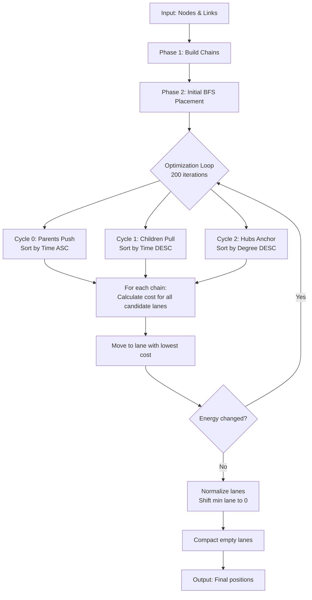

# Timeline Layout Algorithm - Complete Technical Specification

> **Core Concept**: "Tetris with Rubber Bands"  
> A constrained force-directed layout algorithm that arranges team nodes on horizontal "swimlanes" while minimizing visual crossings and maintaining family proximity.

---

## Table of Contents
1. [Fundamental Definitions](#fundamental-definitions)
2. [Algorithm Overview](#algorithm-overview)
3. [Phase 1: Chain Decomposition](#phase-1-chain-decomposition)
4. [Phase 2: Initial Placement](#phase-2-initial-placement)
5. [Phase 3: Optimization Loop](#phase-3-optimization-loop)
6. [Cost Function Details](#cost-function-details)
7. [Math Symbols & Variables Reference](#math-symbols--variables-reference)
8. [Configuration Parameters](#configuration-parameters)

---

## Fundamental Definitions

### What is a Node?
A **Node** represents a single cycling team with the following properties:

```javascript
{
  id: "LPR",                    // Unique identifier
  founding_year: 2004,          // Year the team was founded
  dissolution_year: 2009,       // Year the team dissolved (or null if still active)
  eras: [                       // Array of yearly "slices" (jersey designs, sponsors, etc.)
    { year: 2004, name: "LPR Brakes" },
    { year: 2005, name: "LPR Brakes" },
    // ... one entry per year
  ]
}
```

**Visual Representation**: A node is drawn as a horizontal bar spanning from `founding_year` to `dissolution_year + 1` (inclusive rendering).

**Example**: LPR (2004-2009) visually occupies the space from year 2004 through the end of year 2009.

---

### What is Temporal Overlap?

Two nodes **temporally overlap** if they exist at the same time. This is determined using **inclusive** year boundaries:

```
Node A overlaps Node B if:
  A.start_year ≤ B.end_year  AND  B.start_year ≤ A.end_year
```

**Critical Edge Case - "Touching" Nodes**:
- LPR ends 2009, Utensilnord starts 2010 → **NO OVERLAP** (2009 < 2010)
- Sanson ends 1980, Famcucine starts 1980 → **OVERLAP** (1980 ≤ 1980)

**Why this matters**: Nodes that overlap cannot share the same horizontal lane (swimlane) because they would visually collide.

---

### What is a Chain?

A **Chain** is a linear sequence of nodes connected by 1-to-1 relationships with **no temporal overlap**.

```javascript
{
  id: "chain-0",
  nodes: [LPR, Utensilnord, Katusha],  // Array of node objects
  startTime: 2004,                      // founding_year of first node
  endTime: 2019,                        // dissolution_year of last node (or 9999 if active)
  yIndex: 0                             // Current lane assignment (0 = top lane)
}
```

**Chain Formation Rules**:
1. **Linear Topology**: Each node has exactly 1 predecessor and 1 successor (except endpoints)
2. **No Temporal Overlap**: Consecutive nodes must NOT overlap
3. **Break on Split/Merge**: If a node has multiple children or multiple parents, the chain breaks

**Example Chain**:
```
LPR (2004-2009) → Utensilnord (2010-2015) → Katusha (2016-2019)
```
These three nodes form ONE chain because:
- LPR ends 2009, Utensilnord starts 2010 (no overlap: 2009 < 2010) ✓
- Utensilnord ends 2015, Katusha starts 2016 (no overlap: 2015 < 2016) ✓
- Each has exactly 1 successor/predecessor ✓

**Counter-Example (Chain Break)**:
```
Sanson (1963-1980) ✗ Famcucine (1980-1981)
```
These form TWO separate chains because:
- Sanson ends 1980, Famcucine starts 1980 (overlap: 1980 ≤ 1980) ✗

---

### What is a Link?

A **Link** represents a lineage connection between two teams:

```javascript
{
  source: "LPR",           // Source node ID
  target: "Tinkoff",       // Target node ID
  type: "LEGAL_TRANSFER",  // Type of connection
  year: 2007               // Year the connection occurred
}
```

**Visual Representation**: Links are drawn as curved paths connecting the source node to the target node.

---

### What is a Vertical Segment?

When a link connects nodes in different lanes, it creates a **Vertical Segment** - the portion of the link that crosses intermediate lanes.

```
Lane 0: [LPR]
        |  ← Vertical segment (crosses Lane 1)
Lane 1: |
        ↓
Lane 2: [Tinkoff]
```

**Formal Definition**:
```javascript
{
  y1: 0,              // Source lane
  y2: 2,              // Target lane  
  time: 2007,         // Year of the link
  parentId: "LPR",    // Source chain ID
  childId: "Tinkoff"  // Target chain ID
}
```

**Key Property**: A vertical segment exists at a specific **year** (the link's year) and spans between two **lanes** (y1 to y2).

---

### What is a Cut-Through?

A **Cut-Through** occurs when a node sits in a lane that a vertical segment passes through.

```
Lane 0: [LPR] ────────────┐
                          │ Link at year 2007
Lane 1: [Ceramica]        │ ← CUT-THROUGH! (Ceramica exists in 2007)
                          │
Lane 2: [Tinkoff] ────────┘
```

**Detection Logic**:
```javascript
// For a node in lane Y, check all vertical segments
isCutThrough = (
  Y > segment.y1 &&           // Node is between the two lanes
  Y < segment.y2 &&
  segment.time >= node.start && // Link occurs during node's lifetime
  segment.time <= node.end + 1  // +1 accounts for inclusive rendering
)
```

**Why +1?** Since nodes render inclusively to `dissolution_year + 1`, a node ending in 2009 visually extends to the start of 2010. A link at year 2010 should detect a cut-through with this node.

**Why it's penalized**: Cut-throughs create visual confusion - the link appears to "slice through" an unrelated team.

---

### What is a Blocker?

A **Blocker** occurs when a node sits on top of a vertical segment, blocking the visual "corridor" between parent and child.

```
Lane 0: [Parent] ─────┐
                      │
Lane 1: [Blocker]     │ ← Node blocks the corridor
                      │
Lane 2: [Child] ──────┘
```

**Key Difference from Cut-Through**:
- **Cut-Through**: The link slices through the node (node is the victim)
- **Blocker**: The node blocks someone else's link (node is the perpetrator)

**Exception**: Nodes ignore their own links when calculating blocker cost (it's OK to sit on your own parent→child link).

---

### What is Lane Sharing?
**Lane Sharing** occurs when multiple chains occupy the same horizontal lane.

**Strict Stranger Rule**: Unrelated chains ("strangers") are **strictly forbidden** from sharing a lane unless there is at least a 1-year gap between them. Since nodes render to `dissolution_year + 1`, this means:
- Node A ends in 2009 (renders to 2010)
- Node B starts in 2011
- Gap = 2011 - 2010 = 1 year ✓ (allowed)

**Family Exception**: Parent and child chains can share lanes with temporal overlap, as they are visually connected.

**Distance Decay** (Currently Disabled): The penalty formula remains in the code but with weight set to 0:
```
Penalty = WEIGHT / max(0.5, Gap)
```

---

## Math Symbols & Variables Reference

To clarify the formulas used in the optimization phases, here is a reference of the symbols and variables:

| Symbol | Name | Description |
|:---:|:---|:---|
| $Y$ | **Lane Index** | The vertical coordinate of a chain (0 = top). |
| $T$ | **Time** | An integer year (e.g., 2007). |
| $\mu_{parents}$ | **Mean Parent Lane** | The average $Y$ position of all parent chains connected to the current chain. |
| $\mu_{children}$ | **Mean Child Lane** | The average $Y$ position of all child chains connected to the current chain. |
| $\Delta T$ | **Temporal Gap** | The number of years between two nodes in time. Positive if there is a gap, negative if they overlap. |
| $J$ | **Total Cost** | The "energy" of a specific lane assignment; the algorithm seeks the $Y$ that minimizes this. |
| $W_{XXX}$ | **Weights** | Penalty multipliers (e.g., $W_{ATTRACTION}, W_{CUT\_THROUGH}$) that define how important a constraint is. |
| $P$ | **Parent Lane** | The specific $Y$ coordinate of an individual parent chain. |
| $C$ | **Child Lane** | The specific $Y$ coordinate of an individual child chain. |

---

## Algorithm Overview



---

## Phase 1: Chain Decomposition

**Goal**: Group nodes into rigid linear units that move together.

**Algorithm**:
```
1. Build predecessor/successor maps from links
2. For each unvisited node:
   a. If it's a chain start (0 or >1 predecessors):
      - Walk forward following single successors
      - Stop if: no successor, >1 successors, or temporal overlap
      - Create chain from collected nodes
   b. Mark all nodes in chain as visited
```

**Chain Start Conditions**:
- Node has 0 predecessors (root node)
- Node has >1 predecessors (merge point)
- Node's single predecessor ends ≥ node's start (temporal overlap)

**Chain End Conditions**:
- Node has 0 successors (leaf node)
- Node has >1 successors (split point)
- Node's end ≥ successor's start (temporal overlap)

---

## Phase 2: Initial Placement

**Goal**: Create a starting layout using Breadth-First Search (BFS).

**Algorithm**:
```
1. Identify root chains (no parents)
2. Place roots at lane 0
3. For each chain in BFS order:
   a. Find first available lane (no temporal overlap with existing chains)
   b. Place chain in that lane
```

**Result**: A "tall" layout with families grouped vertically, but potentially with large gaps.

---

## Phase 3: Optimization Loop

**Goal**: Compact the layout and minimize crossings using iterative improvement.

### Iteration Strategy (Tri-State Cycle)

The loop runs 200 times, alternating between three sorting strategies:

**Cycle 0 - Parents Push** (iteration % 3 == 0):
```javascript
chains.sort((a, b) => a.startTime - b.startTime)  // Oldest first
```
Effect: Parents move first, pushing children into better positions.

**Cycle 1 - Children Pull** (iteration % 3 == 1):
```javascript
chains.sort((a, b) => b.startTime - a.startTime)  // Newest first
```
Effect: Children move first, pulling parents toward them.

**Cycle 2 - Hubs Anchor** (iteration % 3 == 2):
```javascript
chains.sort((a, b) => degree(b) - degree(a))  // Most connected first
```
Effect: Highly connected nodes claim optimal central positions first, then less connected nodes snap to them.

### Candidate Search Strategy

For each chain at current lane Y, the algorithm searches:

1. **Local Neighborhood**: Y ± 50 lanes
2. **Parent Vicinity**: If chain has parents at lane P, search P ± 10 lanes
3. **Child Vicinity**: If chain has children at lane C, search C ± 10 lanes

**Collision Check**: Skip candidates where temporal overlap exists with another chain.

**Cost Calculation**: For each valid candidate, calculate total cost.

**Move Decision**: Move to the candidate with the lowest cost (if lower than current cost).

---

## Cost Function Details

For a chain **C** considering a move to lane **Y**, the total cost is:

```
Total Cost = Attraction Cost + Cut-Through Cost + Blocker Cost + Sharing Cost + Y-Shape Cost
```

### 1. Attraction Cost

**Purpose**: Pull chains toward their parents and children to minimize link length.

**Formula**:

```
AttractionCost = WEIGHT_ATTRACTION × (DistanceToParents² + DistanceToChildren²)
```

Where:
```
DistanceToParents = |Y - AverageParentLane|
DistanceToChildren = |Y - AverageChildLane|
```

**Example**:
```
Chain at Y=5
Parents at lanes [2, 4] → Average = 3
Children at lanes [8] → Average = 8

AttractionCost = 100 × ((5-3)² + (5-8)²)
               = 100 × (4 + 9)
               = 1,300
```

**Weight**: 100 (quadratic scaling makes distant moves very expensive)

---

### 2. Cut-Through Cost

**Purpose**: Prevent chains from sitting in lanes where they would be visually sliced by other families' links.

**Formula**:

```
CutThroughCost = WEIGHT_CUT_THROUGH × (Number of cuts)
```

**Detection**:
```
For each vertical segment S:
  If (Y is between S.y1 and S.y2) AND
     (S.time is within chain's temporal range) AND
     (S is not chain's own link):
    Count += 1
```

**Example**:
```
Chain: Ceramica [2005-2010] considering lane Y=1
Segment: LPR(lane 0) → Tinkoff(lane 2) at year 2007

Check:
- 1 is between 0 and 2? YES
- 2007 is within [2005, 2010]? YES
- Segment is not Ceramica's link? YES

CutThroughCost = 10,000 × 1 = 10,000
```

**Weight**: 10,000 (highest penalty - cut-throughs are visually unacceptable)

---

### 3. Blocker Cost

**Purpose**: Discourage chains from blocking other families' vertical links.

**Formula**:

```
BlockerCost = WEIGHT_BLOCKER × (Number of segments blocked)
```

**Detection**:
```
For each vertical segment S:
  If (Y is between S.y1 and S.y2) AND
     (S.time is within chain's temporal range) AND
     (S.parentId ≠ chain.id AND S.childId ≠ chain.id):
    Count += 1
```

**Key Difference**: Chains ignore their own links (it's OK to sit on your own parent→child corridor).

**Weight**: 5,000 (high penalty, but less severe than cut-through)

---

### 4. Lane Sharing Cost ($C_{SHARE}$)

**Purpose**: Enforce strict separation between unrelated chains while allowing family members to share lanes.

**Strict Rule**: Strangers (non-family chains) are **forbidden** from sharing a lane unless there is at least a 1-year gap:
- Visual boundary check: `stranger.end + 1 < mover.start` OR `stranger.start > mover.end + 1`
- If this condition fails, the lane is considered **colliding** and cannot be used.

**Family Exception**: Parent and child chains can share lanes with temporal overlap.

**Formula** (Currently Disabled):
```
SharingCost = WEIGHT_SHARING / max(0.5, TemporalGap)
```

**Weight**: 0 (disabled - strict collision check handles strangers)

**Example**:
```
Chain: Ceramica [2005-2010] considering lane Y=1
Other chain in lane 1: LPR [2004-2009] (stranger)

Visual check: LPR ends 2009 (renders to 2010), Ceramica starts 2005
  2010 < 2005? NO → Collision! Lane forbidden.

If LPR ended 2003 (renders to 2004), Ceramica starts 2005:
  2004 < 2005? YES → Gap = 1 year, allowed.
```

---

### 5. Y-Shape Symmetry Cost

**Purpose**: Create visual symmetry in merge/split patterns by forcing siblings or co-parents to separate by at least 2 lanes.

**Formula**:

```
YShapeCost = WEIGHT_Y_SHAPE × (Number of violations)
```

**Detection**:
```
For each sibling (shares same parent):
  If |Y - Sibling.lane| < 2:
    Count += 1

For each spouse (shares same child):
  If |Y - Spouse.lane| < 2:
    Count += 1
```

**Example**:
```
        Parent (lane 1)
       /              \
Child1 (lane 0)    Child2 (lane 2)

If Child2 considers moving to lane 1:
  |1 - 0| = 1 < 2  → Violation!
  YShapeCost = 150
```

**Weight**: 150 (weak penalty - suggests symmetry but yields to stronger constraints)

---

### Normalization & Compaction

After optimization, two cleanup steps occur:

**1. Normalization** (Shift to Zero):
```
minLane = min(all chain.yIndex values)
If minLane < 0:
  For each chain:
    chain.yIndex -= minLane
```

**Purpose**: Ensure the topmost lane is always lane 0 (no negative lanes in final output).

**2. Compaction** (Remove Gaps):
```
For lane Y from 0 to maxLane:
  If lane Y is empty:
    Shift all chains in lanes > Y down by 1
    Decrement maxLane
    Re-check lane Y (now contains what was Y+1)
```

**Purpose**: Remove empty lanes to create a compact, gap-free layout.

---

## Configuration Parameters

```javascript
export const LAYOUT_CONFIG = {
  ITERATIONS: {
    MIN: 50,                // Minimum iterations for small graphs
    MAX: 500,               // Maximum iterations for large graphs
    MULTIPLIER: 10          // Iterations = numChains × 10 (clamped to MIN/MAX)
  },
  
  SEARCH_RADIUS: 50,        // How far to search around current position
  TARGET_RADIUS: 10,        // How far to search around parent/child positions
  
  WEIGHTS: {
    ATTRACTION: 100.0,
    CUT_THROUGH: 10000.0,
    BLOCKER: 5000.0,
    LANE_SHARING: 0.0,      // Disabled (strict collision handles strangers)
    Y_SHAPE: 150.0
  }
};
```

---

## Known Limitations

### Local Optimization
The algorithm is **greedy** - each chain optimizes its own position without considering global impact. This can lead to:
- **Jitter**: Two chains repeatedly swapping positions
- **Local Minima**: Suboptimal configurations that are stable

**Mitigation**: The tri-state iteration strategy and high iteration count help escape local minima.

### Asymmetric Penalties
Lane sharing penalties are only felt by the **mover**, not the existing occupant. This can cause:
- Chain A moves next to Chain B → A pays penalty
- Chain B doesn't pay penalty until its turn to move
- Result: Chains "flee" each other in alternating iterations

**Mitigation**: High iteration count allows both chains to react and settle.

### Temporal Overlap Edge Cases
The current implementation uses **inclusive** comparison (`>=`) for overlap detection. This means:
- Nodes that "touch" (end year = start year) are treated as overlapping
- This prevents chains like `LPR (2004-2009) → Utensilnord (2010-2015)` from forming

**Impact**: More chains = more optimization complexity, but also more flexibility in positioning.

---

## Debugging Tips

### Visualizing Costs
Add logging to `calculateCost` to see why a chain prefers a specific lane:

```javascript
if (chain.nodes[0].id === "Ceramica") {
  console.log(`Lane ${y}: Attraction=${attractionCost}, Cut=${cutThroughCost}, ...`);
}
```

### Tracing Moves
Log when chains move to understand the optimization flow:

```javascript
if (bestY !== currentY) {
  console.log(`${chain.id} moved from ${currentY} to ${bestY} (cost: ${bestCost})`);
}
```

### Checking Vertical Segments
Verify that vertical segments are correctly identified:

```javascript
console.log("Vertical Segments:", verticalSegments);
```

---

## Glossary

| Term | Definition |
|------|------------|
| **Node** | A single team with founding/dissolution years |
| **Chain** | Linear sequence of nodes with no temporal overlap |
| **Lane** | Horizontal swimlane (Y-coordinate) |
| **Temporal Overlap** | Two nodes exist at the same time |
| **Link** | Connection between two nodes (parent→child) |
| **Vertical Segment** | Portion of a link crossing intermediate lanes |
| **Cut-Through** | Node sits in a lane crossed by another family's link |
| **Blocker** | Node blocks another family's vertical link |
| **Lane Sharing** | Multiple chains in the same lane |
| **Family** | Connected group of chains (via links) |
| **BFS** | Breadth-First Search (initial placement strategy) |
| **Normalization** | Shifting all lanes so minimum lane = 0 |
| **Compaction** | Removing empty lanes |
